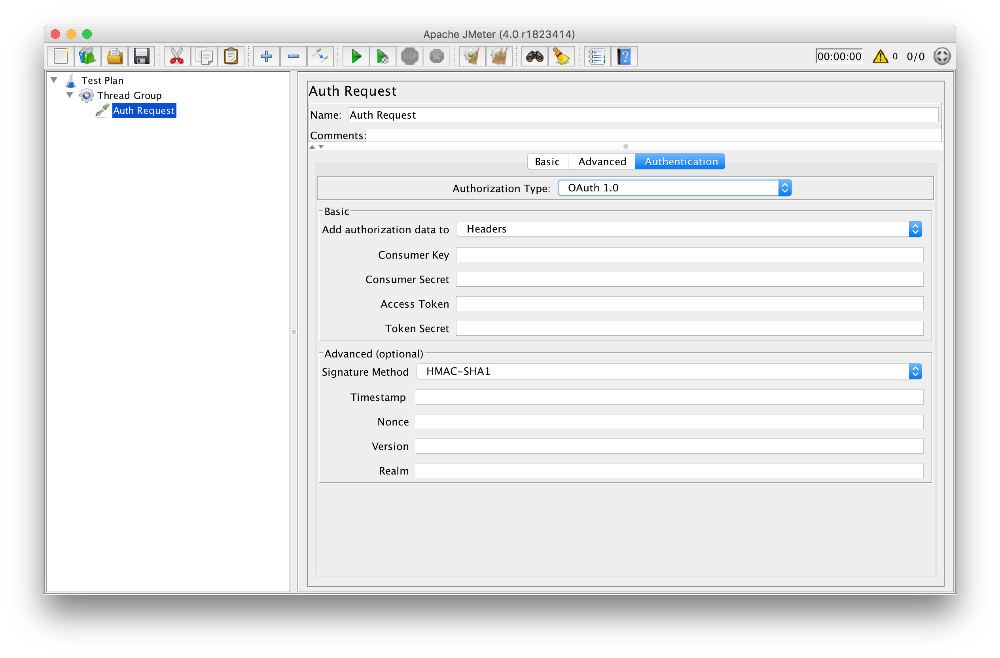

# ApacheJMeter_auth

Support: JMeter v3.3+

Auth sampler - adds the ability to make requests using the following types of authorization:
 - Bearer Token
 - Basic Auth
 - OAuth 1.0
 
# Preview

 
# Download 
[ApacheJMeter_auth v1.0.1 for JMeter 3.3](https://github.com/dlenroc/ApacheJMeter_auth/releases/download/v1.0.1/ApacheJMeter_auth.jar)